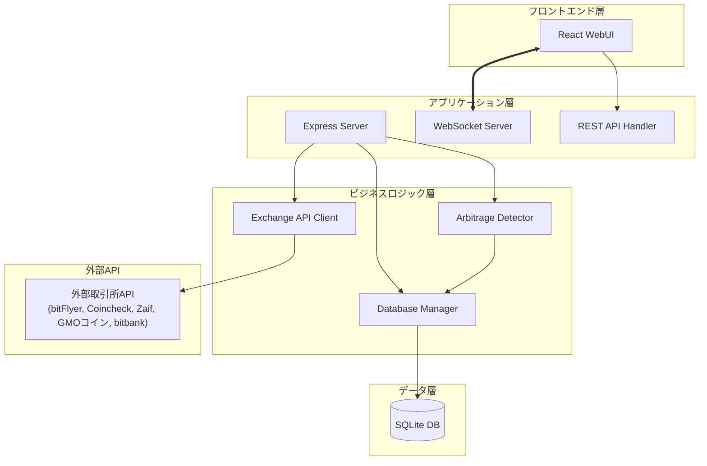
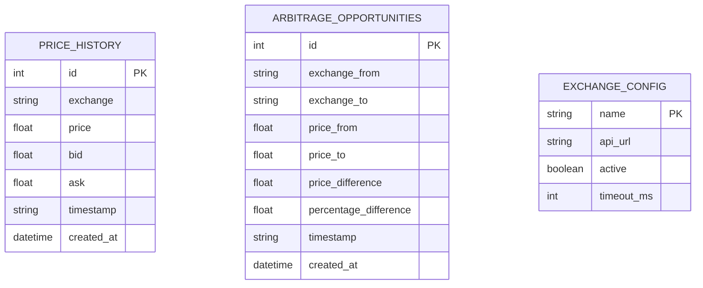
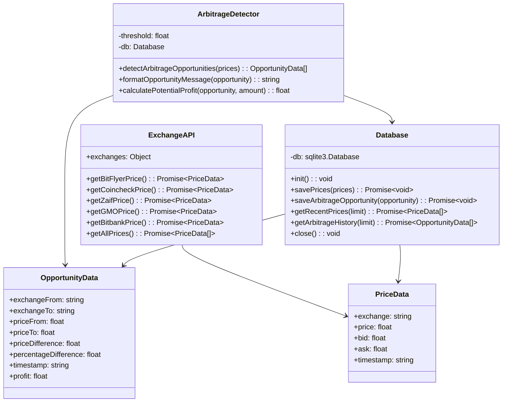
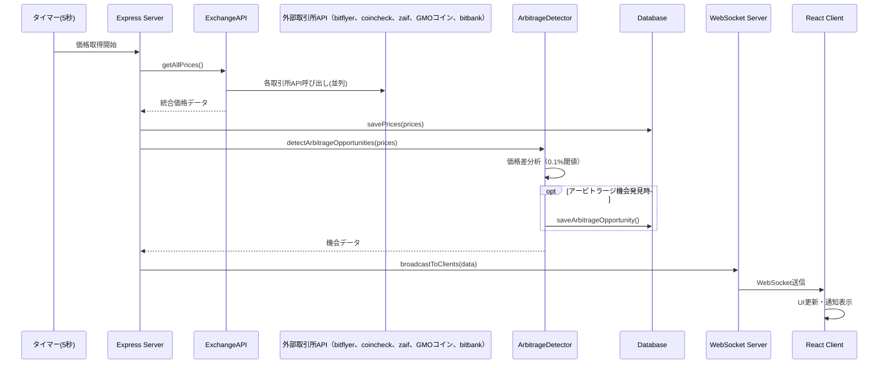
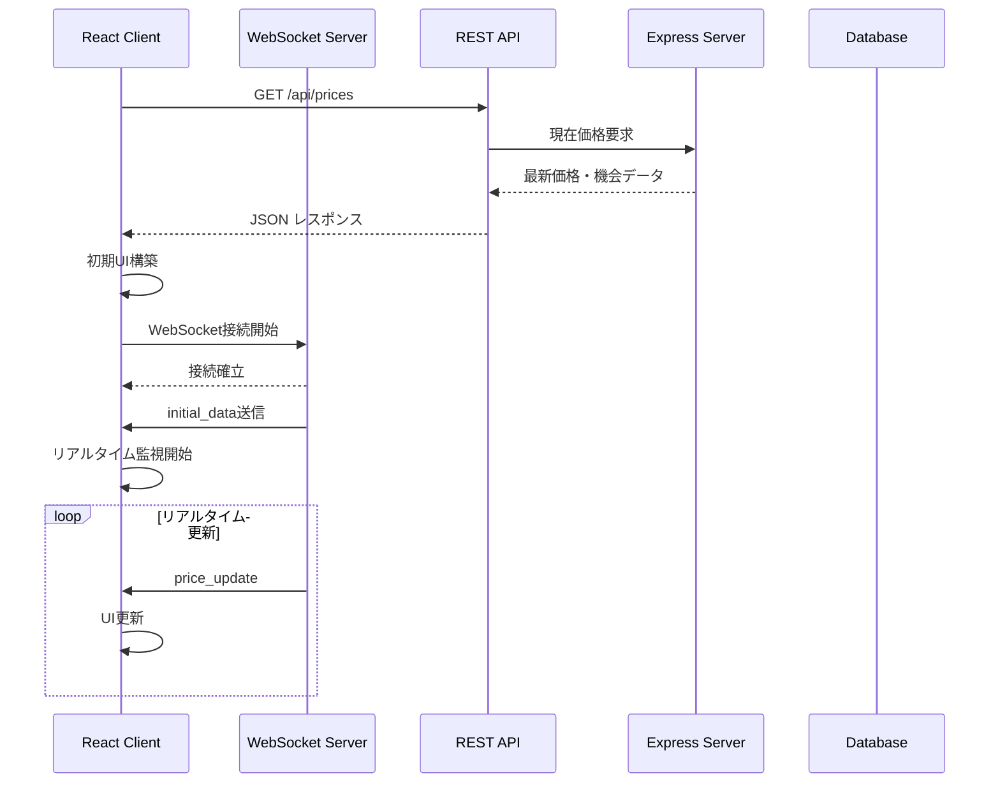

# BTCアービトラージ監視システム 高レベル設計書

## 1. システム概要

### 1.1 目的
ビットコイン（BTC/JPY）の複数取引所間における価格差を監視し、アービトラージ（裁定取引）機会をリアルタイムで検知・通知するWebアプリケーション。

### 1.2 主要機能
- **リアルタイム価格監視**: bitFlyer、Coincheck、Zaif、GMOコイン、bitbankから5秒間隔でBTC/JPY価格を自動取得
- **詳細価格表示**: 各取引所のBid（買値）・Ask（売値）・LTP（最終取引価格）の表示
- **アービトラージ検知**: 取引所間の価格差が0.1%以上の機会を自動検知
- **リアルタイム通知**: WebSocketによる即座のブラウザ通知
- **価格チャート表示**: リアルタイム価格の時系列グラフ表示
- **データ永続化**: 価格履歴とアービトラージ機会の記録・蓄積
- **履歴管理**: 過去の価格変動とアービトラージ機会の照会・CSV出力
- **データ管理**: 蓄積データの一括削除機能

### 1.3 ビジネス価値
- 仮想通貨取引における収益機会の自動発見
- 手動監視コストの削減
- 取引判断の迅速化

## 2. コンポーネント図

### 2.1 コンポーネント責務

| コンポーネント | 責務 |
|------------|------|
| **React WebUI** | ユーザーインターフェース、リアルタイム表示 |
| **Express Server** | HTTPリクエスト処理、ルーティング |
| **WebSocket Server** | リアルタイム双方向通信 |
| **Exchange API Client** | 外部取引所APIとの通信、エラーハンドリング |
| **Arbitrage Detector** | 価格差分析、アービトラージ機会検知 |
| **Database Manager** | データ永続化、履歴管理 |

## 3. データモデル

### 3.1 主要エンティティ

### 3.2 クラス構造

## 4. 主要シーケンス図

### 4.1 価格監視・アービトラージ検知フロー

### 4.2 クライアント接続・初期化フロー

## 5. 非機能要件

### 5.1 性能要件

| 項目 | 要件 | 現状実装 |
|------|------|----------|
| **応答時間** | API応答時間 < 5秒 | 各取引所API timeout: 5秒 |
| **更新頻度** | 価格更新間隔: 5秒 | setInterval: 5000ms |
| **同時接続** | WebSocket: 最大100接続 | 制限なし（要監視） |
| **データ保持** | 履歴データ: 無制限保存 | SQLite（容量制限なし） |

### 5.2 可用性要件

| 項目 | 要件 | 実装状況 |
|------|------|----------|
| **API障害対応** | 個別取引所API障害時も継続動作 | Promise.allSettled使用 |
| **自動復旧** | WebSocket切断時の自動再接続 | 3秒後自動再接続 |
| **エラーハンドリング** | 全APIエラーのログ出力 | console.error実装済み |

### 5.3 セキュリティ要件

| 項目 | 要件 | 実装状況 |
|------|------|----------|
| **データ暗号化** | 機密データなし（公開価格のみ） | 暗号化不要 |
| **認証** | 読み取り専用、認証不要 | 未実装（要検討） |
| **CORS設定** | フロントエンド専用アクセス | cors()設定済み |
| **API制限** | レート制限遵守 | 5秒間隔で自然制限 |

### 5.4 運用性要件

| 項目 | 要件 | 実装状況 |
|------|------|----------|
| **ログ出力** | アービトラージ検知ログ | console.log実装済み |
| **ヘルスチェック** | サーバー死活監視 | 未実装 |
| **設定変更** | 閾値・間隔の動的変更 | 未実装（ハードコード） |
| **データバックアップ** | SQLiteファイルバックアップ | 手動対応 |

### 5.5 拡張性要件

| 項目 | 要件 | 実装状況 |
|------|------|----------|
| **取引所追加** | 新規取引所API対応 | ExchangeAPIクラスで対応可能 |
| **通貨ペア追加** | BTC/JPY以外の対応 | 設計変更必要 |
| **通知機能** | メール・Slack通知 | 未実装 |
| **クラウド対応** | AWS・Azure展開 | Docker化未実装 |

## 6. 技術的制約・前提条件

### 6.1 技術スタック
- **Runtime**: Node.js 18+
- **Framework**: Express.js 4.x, React 18.x
- **Database**: SQLite 3.x
- **通信**: WebSocket (ws), HTTP/REST, axios

### 6.2 外部依存
- bitFlyer Public API (制限: 500req/5min)
- Coincheck Public API (制限: 不明)
- Zaif Public API (制限: 不明)
- GMOコイン Public API (制限: 不明)
- bitbank Public API (制限: 不明)

### 6.3 API Endpoints
- `GET /api/prices` - Current prices and opportunities
- `GET /api/history` - Historical price and arbitrage data (最大100件の価格履歴、50件のアービトラージ履歴)
- `GET /api/price-history?hours=24` - 指定時間の価格履歴データ取得
- `DELETE /api/clear-data` - 全ての価格履歴・アービトラージデータの削除
- `GET /api/export-csv?hours=24` - 価格履歴のCSVエクスポート

### 6.4 制約事項
- 取引実行機能なし（監視・通知のみ）
- シングルサーバー構成（冗長化なし）
- リアルタイム価格（遅延5秒〜）

---
*更新日: 2025年12月6日*  
*バージョン: 2.0*